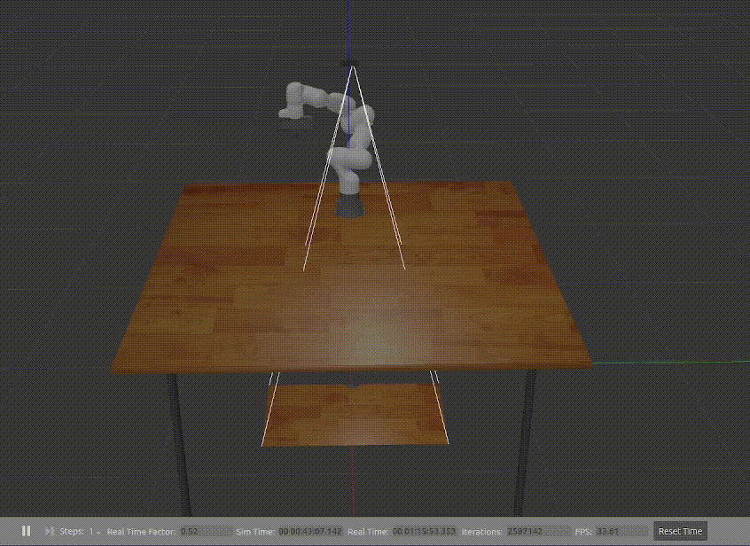

# ELSA Benchmark 

This package is a benchmark for testing the accurracy level of the **ELSA Perception** package in simulation. It uses standard gazebo topics to spawn four different primary shapes (cube, rectangle, cylinder, sphere) and a custom-made .sdf file modifier in order to randomize the size and color of the primary shapes.

## Usage

To run this benchmark start the Gazebo simulator by running:

```bash
    roslaunch elsa_simulator benchmark.launch 
```

This will open a simulation of the Franka Emika Panda with the Intel Realsense on top and a blank table where the benchmark will spawn in the desired objects. Each color you want to test has to be preregistered in the **ELSA Object Database** in order to be picked in randomization (see **ELSA Object Database** package for more details). 

The *benchmark.launch* file starts the following services:

| ROS Service | Arguments | Description |
| ------ | ------ | ------ | 
| */benchmark/perception_benchmark* | (int32)Number_of_scenes (int32)Number_of_objects_per_scene (str)Primary_shape (bool)Save_benchmark_results (str)Benchmark_save_location | Starts the benchmark |
| */benchmark/clear_scene* | *None* | Deletes all registered objects from the scene |
| */benchmark/spawn_specific_scene* | (str)Benchmark_file (int32)Scene | Spawns one specific scene from a stored benchmark for closer inspection |

### Example

Here are two example usages for the */benchmark/perception_benchmark* service:

```bash
    rosservice call /benchmark/perception_benchmark 200 1 rectangle True "/home/user/benchmark/"
```




```bash
    rosservice call /benchmark/perception_benchmark 100 2 sphere False "I will be ingnored because save benchmark is set to false." 
```

## Return values

### */benchmark/perception_benchmark* service

This service returns a error summary upon completion with following metrics:

- mean error
- std error
- max error
- min error 

This will be returned for all scenes combined and then additionally all four metrics will be returned for the color dimensions individually (to detect whether a specific color has a greater error) and for all 4 quadrants (to see if the position with respect to the camera plane is significant for good perception).

### */benchmark/clear_scene* service

Returns True if the model deletion was successful.

### */benchmark/spawn_specific_scene* service

Returns True if the scene was spawned successfully.

## Benchmark result file

If the flag for saving the benchmark is set to true a .csv file will created at the specified storage location. The file will be populated scene by scene where one row equates to one object spawned in the scene with the following information:

| Header | Type | Desciption |
| ------ | ------ | ------ |
| scene | integer | ID of scene the object was spawned in |
| object_color | string | Object color as specified in the Object Database |
| object_type | string | One of four primary object types |
| gt_x | float | Ground truth x-position of spawned object |
| gt_y | float | Ground truth y-position of spawned object |
| gt_z | float | Ground truth z-position of spawned object |
| gt_phi | float | Ground truth orientation of spawned object |
| gt_dx | float | Ground truth bounding box x dimension of spawned object |
| gt_dy | float | Ground truth bounding box y dimension of spawned object |
| gt_dz | float | Ground truth bounding box z dimension of spawned object |
| x | float | Percived x-position of spawned object |
| y | float | Percived y-position of spawned object |
| z | float | Percived z-position of spawned object |
| phi | float | Ground truth orientation of spawned object |
| dx | float | Percived bounding box x dimension of spawned object |
| dy | float | Percived bounding box y dimension of spawned object |
| dz | float | Percived bounding box z dimension of spawned object |
| gt_round | bool | Flag is true if the ground truth object is round in the xy-plane |
| round | bool | Flag is true if the percieved object is round in the xy-plane |

> [!WARNING]
> If the object was not percieved all the non-ground truth values will remain empty!


