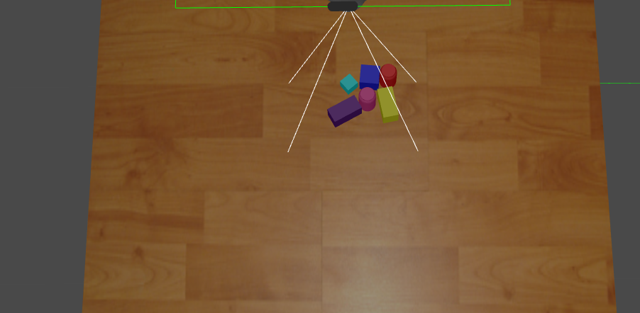
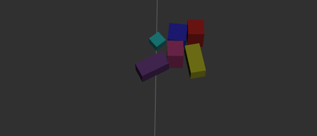

# ELSA Perception

As already described in the main Readme the perception pipeline is the heart of this package. The Franka Emika Panda representation and simulation are mostly inherited from the GitHub package [*Panda Simulator*][pandasim-repo] and the Intel [*RealSense Gazebo plugin fork*][realsense_gazebo] as well as the [*RealSense ROS*][realsense] package. The main contribution of this package is the combination of those packages in order to create a simulated environment in Gazebo with a real world counterpart in order to speed up real world training by simulation. 

All the necessary custom messages for this package can be found in the package *elsa_perception_msgs*.

## Perception pipeline

In order to have maximum overlay between the real world perception and Gazebo perception both use the same underlying scene and object representation. The main difference between real world and simulation is the first step of the pipeline which is from which topic the point cloud is read. 

The pipeline consists of the following steps:

1. RGB-D point cloud subsciption and conversion into a Numpy array.
2. Scene decomposition into objects
3. Object bounding box calculation
4. Object surface feature calculation 
5. Object shape index calculation

### 1. RGB-D point cloud subscription

In this first step in the perception pipeline we differenciate between real world and simulation by either launching `node_gazebo_read_camera.py` or `node_read_camera.py`. This is achived by starting the correct launch file. For real world launch `realsense_cam.launch` from the *elsa_perception* package and for simulation use one of the launch files from the *elsa_simulator* package.

This step in both cases subscribes to the topic `/downsample/output` which is mapped to the correct full information point cloud topic in its respective launch file. The points of the point cloud are read and then each goes through the same steps 2 to 5. It publishes the following topics:

| Topic | Description | Gazebo exclusive |
| ------ | ------ | ------ |
| */scene_description* | This topic has the message type *PhysicalScene* which is a collection of objects with the respective bounding box, surface features and percieved mean color and registered object identity | No |
| */scene_description_stamped* | This topic has the message type *PhysicalSceneStamped* which is the same as *PhysicalScene* with an additional stamp header. | Yes (currently) |
| */fullscene* | This topic has the message type *FullSceneStamped* which combines the physical features from *PhysicalScene* with dummy social features. | Yes (currently) |
| */clustered_pointcloud* | This topic is of message type *ClusteredPointcloud* which holds 4 lists with x,y,z value of each cluster point and a cluster_label which in order to distinguish which object the point belongs to. | No |

### 2. Scene decomposition into objects

The read camera node creates a custom object `PointCloudScene` which has multiple methods for decomposing the point cloud into seperate objects. This classes purpose is to call the remaining steps of the pipeline. It holds a collection of all the objects in the scene which are represented as members of the`PointCloudObject` class. The first goal of this step in the pipeline is to remove the ground. This enables us to use an unsupervised clustering algrithm called [*DBSCAN*][dbscan] in the spartial domain to seperate objects which do not touch. Afterwards DBSCAN is called once more on each object seperatly but his time in a circular parametized h-space in color to seperate objects which are in contact and could not be destiguished in the spartial DBSCAN case. 

 

  <figure>
        
        
        <figcaption>Gazebo scene (left), percieved scene as bounding boxes in Rviz (right)</figcaption>
    </figure> 

### 3. Bounding box

### 4. Surface features 

### 5. Shape indizes

[pandasim-repo]: <https://github.com/justagist/panda_simulator>

[realsense_gazebo]: <https://github.com/marko-zaric/realsense_gazebo_plugin>

[realsense]: <https://github.com/IntelRealSense/realsense-ros>

[dbscan]: <https://scikit-learn.org/stable/modules/generated/sklearn.cluster.DBSCAN.html>

